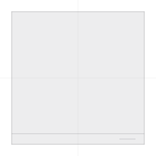
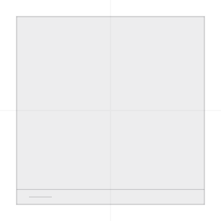

# Furniture reflection — September 12, 2026

The native Mirror action previously negated rotation. Native `450b913` uses
optional local-axis reflection fields, preserves rotation and duplication state,
and applies reflection to plan glyphs, SceneKit geometry, neutral mesh exports
and RoomPlan transforms. Web package edits retain scale magnitudes and independent
reflection signs; older native omissions fall back to the package baseline.
RoomPlan import preserves equivalent orientation through matrix decomposition.
See [the package contract](../project-package-v1.md#furniture-reflection).

Verified native evidence:

- Combined run `85762` passed all three coding/transform, RoomPlan round-trip and
  outward-face tests; xcresult summary confirms zero failures or skips.
- Pixel run `12787` passed `testRefrigeratorHandleReflectsAcrossLocalX`, using the
  actual `PlanRenderer` and an off-centre refrigerator handle. The check requires
  visible pixel changes and horizontal reflection equality. Its two retained
  images were exported and visually inspected: the handle moves from right to
  left, with the body unchanged. This qualifies the renderer, not the live button.

Original:

Reflected:

All 31 package and 28 web RoomPlan tests passed. Both type checks passed without
diagnostics. Current full unit run `32001` passed 1,135/1,136: its sole failure
was an exact old-fixture expectation omitting the newly exported `mirrorX: true`.
The expectation now explicitly includes that field for every mirrored fixture
item while retaining exact comparisons of all other fields. All 55 category
cases passed in `58515`. Current production build `69534` passed.

Five previously timed-out browser workflows passed on the earlier package-only
reflection build (`67115`); their assertions were retained and whole-workflow
budgets increased using traced action durations. They do not qualify the newer
RoomPlan build. Full browser run `96834` and fresh Catalyst build `11694` are active
at this checkpoint. Live Mirror/Undo/Redo, an actual reflected package return and
physical-device checks remain open. No release or full-browser pass is claimed.

## Live Catalyst verification

Build `11694` passed. A copied, independently signed app at
`/tmp/OpenPlan3D-Reflection-Sept12-QA.app` uses bundle identifier
`com.laan.labs.floorplan.reflectionsept12qa`; the Development app was not used.
In a fresh drawn plan, a refrigerator was added and rotated right 15 degrees.
Live screenshots before/after Mirror showed the handle moving from right to left
without changing the angle. Undo returned the handle to the right; Redo moved it
left again. Selection dismissal changes available canvas space, so those history
screenshots are not used as exact screen-position comparisons.

Done saved isolated session `11CD2155-A6F3-43B7-8BBE-CB028C770C6C`. Its sole
furniture record has `mirrorX: true`, angle `0.2617993877991494`, center `(2.5, 2)`
and width/depth `0.7` metres. This verifies the live command and persisted state.
An actual reflected package export/import remains the next interoperability check.

Review also found that the new package reflection type validation was applying to
non-furniture records. It now validates the flags only on furniture, preserving
unrelated native extension fields with the same names on walls/rooms. All 32
package tests passed (`21070`, `/tmp/web-reflection-extension-scope-tests.log`).
The active full browser run `96834` uses the production build before this narrow
validator correction; its results must retain that source provenance.

## Actual native UI package fixture

The isolated app exported the saved reflected plan via Export → Export Options
→ Export Project Package. A first Save/Go-to-folder attempt dismissed without a
file; retrying with the Save dialog's Documents destination succeeded. The actual
1,197-byte ZIP is committed as `tests/fixtures/native-ui-reflection-package.zip`.
It contains the native refrigerator record with `mirrorX: true` and the original
15-degree angle, 0.7-metre dimensions and `(2.5, 2)` center.

Web package tests import that exact file, verify the `fridge` identity, signed
scale, centimetre dimensions and rotation, re-export it, compare every furniture
field with the original (UUID letter case normalized), and import the web return
again to check retained reflection. All 33 package tests passed in `43006`, log
`/tmp/web-native-ui-reflection-package-tests-final.log`. The first run `61310`
failed an exact 15-degree expectation because radians conversion yielded
14.999999999999998; the angle now uses a ten-decimal-place tolerance. No runtime
change was needed. This is actual native UI export plus web service import/return,
not a fresh native UI import of that web return or a physical-device handoff.
